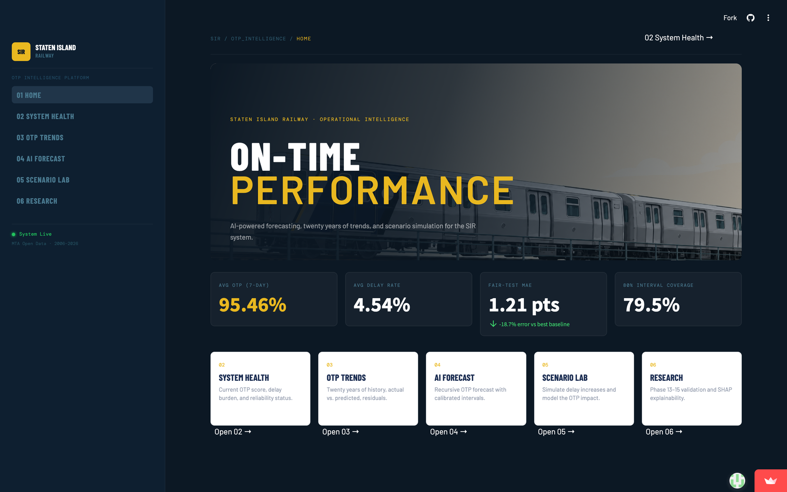
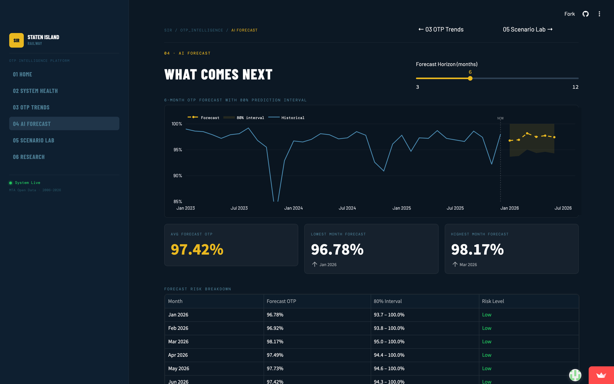

# Staten Island Railway OTP Forecasting & Explainable AI Dashboard

[](https://github.com/naringrekarchinmay/staten-island-otp-forecasting/actions/workflows/ci.yml)
[](https://staten-island-otp-forecasting.streamlit.app)
[](https://www.python.org/)

### [→ Open the live dashboard](https://staten-island-otp-forecasting.streamlit.app)

The MTA publishes Staten Island Railway on-time performance every month, but only as history: what already happened, never what is coming. This project forecasts next month's OTP from twenty years of that data, then wraps the forecast in intervals that say how wrong it is likely to be.

XGBoost beat every baseline tested, including SARIMA and Prophet. The simple baselines were harder to beat than expected: a 6-month moving average finished second and outperformed both statistical models.

[](https://staten-island-otp-forecasting.streamlit.app)

## Headline Results

| Metric | Result | How it was measured |
| ------ | ------ | ------------------- |
| Forecast error (MAE) | **1.21 OTP points** | Fair hold-out, Aug 2025 to Jan 2026 |
| vs. best baseline | **18.7% lower error** | 6-month moving average, MAE 1.4861 |
| vs. SARIMA / Prophet | 48.3% / 47.7% lower error | MAE 2.3357 / 2.3118 |
| Cross-validated MAE | 2.11 ± 0.59 | 5 expanding-window folds, 2009 to 2026 |
| 80% interval coverage | 79.5% observed | Residual intervals on CV predictions |
| 90% interval coverage | 89.7% observed | Residual intervals on CV predictions |

Cross-validated error (2.11) is meaningfully worse than the recent hold-out error (1.21), because the early folds train on very little history and span the pandemic. Both numbers are reported here rather than only the flattering one. Every figure is reproduced from the CSVs in [`outputs/reports/`](outputs/reports) and is regenerated by the notebooks.

## Quickstart

```bash
pip install -r requirements.txt
streamlit run app/streamlit_app.py
```

That installs only what the dashboard needs. To re-run the notebooks, install the full modelling stack with `pip install -r requirements-notebooks.txt`, and see [How to Run](#how-to-run) for the notebook order.

Run the test suite with:

```bash
pip install -r requirements-dev.txt && pytest tests/
```

## Limitations

* **Small effective sample.** The 7-Day series has 241 monthly observations and the fair test window is six months. Metric estimates carry wide sampling error, and R² is unstable: it averages 0.18 across CV folds with a standard deviation of 0.39, and is negative in two of five folds.
* **Era dependence.** The model is most trustworthy where training history is long and conditions resemble the recent past. Fold 1 (MAE 2.93) and fold 5 (MAE 1.30) differ by more than a factor of two.
* **No external drivers.** Weather, incidents, maintenance, and ridership are not in the feature set, so the model extrapolates internal momentum and seasonality and cannot anticipate externally caused disruption.
* **Intervals are one-step.** The calibrated 80% and 90% intervals apply to the one-month-ahead forecast. Multi-month forecasts feed predictions back as inputs, so error compounds with horizon and the plotted band understates uncertainty in later months.
* **One line, one metric.** Results are specific to the SIR 7-Day OTP (without boat) series and should be revalidated before being applied to other lines or reliability measures.

---

## Project Overview

The goal of this project is to move beyond traditional historical reporting and build an applied machine learning system that can:

* Analyze historical Staten Island Railway OTP trends
* Predict OTP using machine learning models
* Compare actual vs predicted performance
* Benchmark machine learning against simple and statistical forecasting baselines
* Evaluate model stability using time-series cross-validation
* Estimate uncertainty using prediction intervals
* Explain model behavior using SHAP
* Forecast future OTP trends
* Classify future forecast periods into operational risk levels
* Present results through an interactive Streamlit dashboard

The core pipeline, dashboard, and research write-up are complete; the project continues to be extended as an applied AI, machine learning, and transportation analytics project (see Future Work).

---

## Research Direction

The current research question is:

**Can gradient-boosted tree models with explainability and uncertainty estimation improve short-horizon commuter rail on-time performance forecasting compared with traditional statistical and simple time-series baselines?**

This project evaluates whether XGBoost can provide meaningful forecasting improvement over simpler forecasting approaches such as naive forecasting, moving averages, SARIMA, and Prophet.

The project also studies whether model predictions can be made more useful for operational decision-making by adding:

* SHAP-based explainability
* Time-aware validation
* Prediction intervals
* Operational risk classification
* Future weather and external feature enhancement

---

## Key Features

* Interactive Streamlit dashboard
* Historical OTP trend analysis
* Dynamic filtering by operational period
* Actual vs predicted OTP visualization
* XGBoost-based OTP forecasting model
* Recursive multi-month future OTP forecasting
* Operational risk scoring for forecasted months
* SHAP explainability for model interpretation
* Baseline comparison against Naive, Moving Average, SARIMA, and Prophet models
* Time-series cross-validation using chronological folds
* Residual-based prediction intervals for forecast uncertainty
* Executive-style KPI cards
* Forecast outlook messaging

---

## Dashboard Capabilities

The dashboard is a six-page Streamlit app built in a dark "Dispatch" command-center design (see [DESIGN.md](DESIGN.md) and [PRODUCT.md](PRODUCT.md)). Navigation is a hidden `st.navigation` menu with a custom sidebar; each page lives in its own module under `app/views/`.

| # | Page | Purpose |
| - | ---- | ------- |
| 01 | **Home** | Hero landing with executive KPI cards (average OTP, delay rate, best/worst OTP) and chapter links into the rest of the app |
| 02 | **System Health** | "How are we doing?" — monthly OTP with a 6-month rolling average and current-status readouts |
| 03 | **OTP Trends** | Historical trend analysis: OTP by service category, actual vs. predicted OTP (out-of-sample CV), and the prediction-residual distribution |
| 04 | **AI Forecast** | Recursive multi-month XGBoost forecast (3–12 month horizon), forecast KPI cards, and an operational risk breakdown |
| 05 | **Scenario Lab** | "What if?" — interactive scenario forecasting compared against a baseline, with a scenario risk comparison |
| 06 | **Research** | The validation evidence: Phase 13 model comparison (MAE/RMSE), Phase 14 cross-validation by fold, error vs. training history, and Phase 15 interval coverage |

All six pages are live at [staten-island-otp-forecasting.streamlit.app](https://staten-island-otp-forecasting.streamlit.app). The AI Forecast page below shows the recursive forecast, its 80% prediction interval, and the per-month risk breakdown:

[](https://staten-island-otp-forecasting.streamlit.app/forecast)

### Operational Risk Scoring

Forecasted months are classified into operational risk levels:

| Forecasted OTP | Risk Level  |
| -------------- | ----------- |
| >= 95%         | Low Risk    |
| 90% - 95%      | Medium Risk |
| < 90%          | High Risk   |

The AI Forecast page also provides a simple operational outlook message based on the forecasted risk levels.

### Explainable AI

SHAP (SHapley Additive Explanations) is used to identify which features most influence the model’s OTP predictions.

Key operational drivers identified include:

* Month / seasonality
* Delay Rate
* Recent OTP momentum (lag features)
* Rolling operational trends

---

## Tech Stack

* Python
* Pandas
* NumPy
* Scikit-learn
* XGBoost
* SHAP
* Streamlit
* Plotly
* Matplotlib
* Seaborn
* Statsmodels
* Prophet
* Joblib
* OpenPyXL
* Jupyter Notebook

---

## Machine Learning Workflow

The project follows a structured machine learning and research workflow:

1. Data loading and initial review
2. Data cleaning and preprocessing
3. Exploratory data analysis
4. Time-series feature engineering
5. Model training and evaluation
6. Explainable AI analysis using SHAP
7. Future OTP forecasting
8. Streamlit dashboard development
9. Operational risk scoring
10. Baseline model comparison
11. Time-series cross-validation
12. Prediction interval estimation
13. Formal research question and methodology development


---

## Models Used

The following regression and forecasting models were tested:

* Linear Regression
* Random Forest Regressor
* XGBoost Regressor
* Naive Baseline
* 3-Month Moving Average
* 6-Month Moving Average
* SARIMA
* Prophet

Among the machine learning models, results were mixed: Linear Regression achieved the lowest MAE, while XGBoost achieved the lowest RMSE and the highest R². XGBoost was selected as the main forecasting model because it performed best on the variance-sensitive metrics (RMSE and R²), captures non-linear feature interactions, and held up in the later validation phases (fair baseline comparison and time-series cross-validation). It was carried forward for dashboard integration and further research development.

---

## Why These Models Were Used

### Linear Regression

Used as a simple baseline model to understand whether linear relationships exist between operational features and future OTP.

### Random Forest Regressor

Used to capture non-linear relationships and operational threshold effects that a simple linear model may miss.

### XGBoost Regressor

Used as the main model because it performs well on structured/tabular data and can capture complex interactions between delay metrics, lag features, rolling averages, and seasonal patterns.

### Naive Baseline

Used as a simple forecasting benchmark where the next month’s OTP is assumed to be the same as the most recent observed OTP.

### Moving Average Baselines

Used to compare the machine learning model against simple historical smoothing methods. Both 3-month and 6-month moving averages were tested.

### SARIMA

Used as a traditional statistical time-series forecasting baseline that can account for trend, autocorrelation, and seasonality.

### Prophet

Used as an additional forecasting baseline designed for time-series data with trend and seasonal components.

---

## Data

Monthly Staten Island Railway on-time performance is published by the MTA at [metrics.mta.info](https://metrics.mta.info/?subway/statenislandrailwaymetrics). The copy committed to this repository was downloaded from there and covers **2006-01 through 2026-01**: 1,205 rows across five Day Time categories, of which 241 are the 7-Day series used as the modelling target.

The dataset is committed rather than fetched at runtime, so the dashboard and notebooks are reproducible without network access. The MTA publishes new months on a rolling basis, which means this snapshot falls behind over time; refreshing it means re-downloading from the link above and re-running notebooks 01 to 03 before any later notebook, since every downstream artifact depends on the cleaned data and feature table. Automating that refresh is listed under Future Work.

## Feature Engineering

The model uses several time-series and operational features, including:

* OTP lag features
* Delayed train lag features
* Rolling OTP averages
* Rolling delayed train averages
* Delay rate
* Year
* Month number
* Quarter
* Season
* Day Time category
* Scheduled trips
* Incomplete trips
* Trip completion percentage

These features help the model understand historical operational momentum, delay patterns, and seasonal reliability trends.

For the main research comparison, the project uses **7-Day On-Time Performance (without boat)** as the target variable so that each month has one consistent OTP value. This is the `On-Time Performance` column in the MTA dataset (not the `On-Time Performance (With Boat)` variant), filtered to the `7-Day` Day Time category.

---

## Future Forecasting

The project includes a recursive multi-month forecasting engine.

The forecasting approach works by:

1. Taking the latest available operational state
2. Predicting the next month’s OTP
3. Feeding that prediction back into the model as a lag feature
4. Repeating the process for the selected forecast horizon

This allows the dashboard to generate future OTP projections for 3 to 12 months.

---

## Explainable AI

SHAP was used to interpret the XGBoost model and understand which features most influenced OTP predictions.

This adds transparency to the machine learning process and helps move the project beyond black-box forecasting.

Instead of only asking:

> What did the model predict?

The project also asks:

> Why did the model make that prediction?

---

## Phase 13: Baseline Model Comparison

Phase 13 compared XGBoost against simple and statistical baseline forecasting models.

Models compared:

* Naive Baseline
* 3-Month Moving Average
* 6-Month Moving Average
* SARIMA
* Prophet
* Fairly retrained XGBoost

To avoid data leakage, XGBoost was retrained using only data available before the test period.

### Phase 13 Test Setup

* Training data: through July 2025
* Test period: August 2025 to January 2026
* Target: 7-Day On-Time Performance (without boat)

### Phase 13 Results

| Model                  |    MAE |   RMSE |      R² |   MAPE |
| ---------------------- | -----: | -----: | ------: | -----: |
| XGBoost Fair           | 1.2087 | 1.4974 |  0.4821 | 1.2394 |
| 6-Month Moving Average | 1.4861 | 2.3443 | -0.2695 | 1.5743 |
| 3-Month Moving Average | 1.7556 | 2.4616 | -0.3998 | 1.8507 |
| Prophet                | 2.3118 | 2.6438 | -0.6147 | 2.4095 |
| SARIMA                 | 2.3357 | 2.7753 | -0.7793 | 2.4368 |
| Naive Baseline         | 2.6833 | 3.3855 | -1.6477 | 2.7982 |

### Phase 13 Finding

XGBoost achieved the lowest MAE and RMSE in the fair holdout comparison.

Compared with the strongest simple baseline, the 6-month moving average, XGBoost reduced average forecast error by approximately **18.7%**.

This phase shows that XGBoost provides meaningful predictive improvement over simple and statistical forecasting baselines in the recent holdout test period.

---

## Phase 14: Time-Series Cross-Validation

Phase 14 evaluated the XGBoost model using time-aware cross-validation.

Instead of relying on only one train-test split, the model was evaluated across five chronological folds. Each fold trained on past data and tested on a future period.

### Phase 14 Average Results

| Metric       |   Value |
| ------------ | ------: |
| Average MAE  |  2.1107 |
| Average RMSE |  2.8548 |
| Average R²   |  0.1820 |
| Average MAPE | 2.2677% |

### Phase 14 Fold Results

| Fold | Test Period        |    MAE |   RMSE |      R² |    MAPE |
| ---: | ------------------ | -----: | -----: | ------: | ------: |
|    1 | 2009-11 to 2013-01 | 2.9296 | 4.5795 | -0.1290 | 3.2965% |
|    2 | 2013-02 to 2016-04 | 2.3389 | 2.9250 |  0.2476 | 2.5131% |
|    3 | 2016-05 to 2019-07 | 2.0246 | 2.4106 |  0.5144 | 2.1062% |
|    4 | 2019-08 to 2022-10 | 1.9601 | 2.3407 | -0.3092 | 2.0273% |
|    5 | 2022-11 to 2026-01 | 1.3003 | 2.0180 |  0.5861 | 1.3953% |

### Phase 14 Finding

The model generally performed better as more historical training data became available.

Fold 5, which used the largest and most recent training window, achieved the best performance with an MAE of **1.3003** and an R² of **0.5861**.

This suggests that the XGBoost model benefits from longer historical training windows and may become more reliable as additional monthly OTP data is added.

---

## Phase 15: Prediction Intervals

Phase 15 added residual-based prediction intervals using cross-validation residuals from Phase 14.

Instead of only providing a point prediction, the model now estimates a likely range for actual OTP.

### Phase 15 Method

Residuals were calculated as:

```text
Residual = Actual OTP - Predicted OTP
```

Prediction intervals were created using residual percentiles:

* 80% interval: 10th percentile residual to 90th percentile residual
* 90% interval: 5th percentile residual to 95th percentile residual

### Phase 15 Interval Results

| Interval                | Expected Coverage | Actual Coverage | Average Interval Width |
| ----------------------- | ----------------: | --------------: | ---------------------: |
| 80% Prediction Interval |               80% |          79.49% |      6.2958 OTP points |
| 90% Prediction Interval |               90% |          89.74% |      8.1776 OTP points |

### Phase 15 Finding

The prediction intervals were well calibrated.

The 80% interval captured **79.49%** of actual OTP values, and the 90% interval captured **89.74%** of actual OTP values. These observed coverage rates are very close to the expected coverage levels.

This improves the project by moving beyond point forecasting and adding uncertainty estimation, which is useful for operational decision-making.

---
## Phase 16: Research Question and Methodology

Phase 16 formally defines the research direction, methodology, hypotheses, limitations, and expected contribution of the Staten Island Railway OTP forecasting project.

The purpose of this phase is to move the project from a technical machine learning implementation into a structured applied research study.

### Phase 16 Main Research Question

Can gradient-boosted tree models using lag-based, rolling-window, calendar, and operational features outperform traditional statistical time-series baselines such as SARIMA and Prophet in forecasting short-horizon commuter rail on-time performance, while providing interpretable operational insights through SHAP analysis?

### Supporting Research Questions

* Do machine learning models produce lower prediction error than traditional statistical forecasting models for monthly Staten Island Railway OTP forecasting?
* Which historical, seasonal, and operational features contribute most strongly to OTP prediction?
* How stable is model performance when evaluated using time-aware cross-validation instead of a single train-test split?
* Can prediction intervals provide useful uncertainty estimates around OTP forecasts for operational decision-making?
* Can the forecasting framework support proactive planning by identifying future months or periods with increased risk of lower OTP?

### Research Hypotheses

* XGBoost will achieve lower MAE and RMSE than SARIMA and Prophet baselines for short-horizon OTP forecasting.
* Lag-based OTP features and rolling-window averages will be among the strongest predictors of future OTP.
* Time-aware cross-validation will provide a more realistic estimate of model performance than a single train-test split.
* SHAP explainability will reveal interpretable relationships between historical OTP behavior, seasonal patterns, and predicted OTP.
* Prediction intervals and future risk classification can make the forecasting framework more useful for operational planning than point forecasts alone.

### Methodology Summary

The project follows a structured methodology:

1. Collect monthly Staten Island Railway OTP data from MTA open data.
2. Clean and prepare the data for time-series analysis.
3. Conduct exploratory data analysis to identify trends, seasonality, and variation.
4. Transform the time-series forecasting problem into a supervised machine learning problem using lag, rolling-window, calendar, and trend features.
5. Train traditional statistical baseline models including SARIMA and Prophet.
6. Train machine learning models including Linear Regression, Random Forest, and XGBoost.
7. Evaluate models using MAE, RMSE, R², and MAPE.
8. Use TimeSeriesSplit cross-validation to test model stability across chronological folds.
9. Apply SHAP explainability to interpret the selected machine learning model (XGBoost).
10. Add prediction intervals to communicate forecast uncertainty.
11. Use the results to support future OTP risk classification and operational decision-support analysis.

### Phase 16 Finding

Phase 16 strengthens the academic and research value of the project by clearly defining the research question, supporting research questions, hypotheses, methodology, limitations, and future direction.

The project is now framed as a comparative forecasting study that evaluates whether machine learning models can outperform traditional statistical baselines while also providing interpretable and uncertainty-aware forecasting outputs.

---

## Key Outputs

```text
outputs/
├── figures/
│   ├── phase13_model_comparison_mae.png
│   ├── phase13_actual_vs_baseline_predictions.png
│   ├── phase13_actual_vs_key_models.png
│   ├── phase14_cv_mae_by_fold.png
│   ├── phase14_cv_actual_vs_predicted.png
│   ├── phase15_interval_coverage.png
│   └── phase15_prediction_intervals.png
│
├── predictions/
│   ├── phase13_baseline_predictions.csv
│   ├── phase14_cv_predictions.csv
│   └── phase15_prediction_intervals.csv
│
└── reports/
    ├── phase13_model_comparison.csv
    ├── phase14_timeseries_cv_results.csv
    ├── phase14_timeseries_cv_summary.csv
    ├── phase15_prediction_interval_summary.csv
    └── phase15_findings.txt
```

---

## Deliverables

Final write-up and presentation artifacts live in `reports/`:

* `reports/final_report.md` — full project report in Markdown
* `reports/final_report.pdf` — rendered PDF report with embedded figures
* `reports/final_presentation.pptx` — presentation deck

---

## Project Structure

```text
staten-island-otp-forecasting/
│
├── app/                          # Multi-page Streamlit dashboard ("Dispatch" design)
│   ├── streamlit_app.py          # Entry point + sidebar + st.navigation
│   ├── views/                    # One module per page
│   │   ├── home.py
│   │   ├── health.py
│   │   ├── trends.py
│   │   ├── forecast.py
│   │   ├── scenario.py
│   │   └── research.py
│   ├── shared/                   # data.py, charts.py, styles.py helpers
│   └── static/                   # Image assets
│
├── data/
│   └── raw/                      # Raw MTA .xlsx + cleaned_staten_island_otp.csv
│
├── models/
│   └── xgboost_otp_model.pkl     # Trained forecasting model
│
├── notebooks/
│   ├── 01_data_loading_and_initial_review.ipynb
│   ├── 02_eda.ipynb
│   ├── 03_feature_engineering.ipynb
│   ├── 04_model_training.ipynb
│   ├── 05_explainability.ipynb
│   ├── 06_future_forecasting.ipynb
│   ├── 07_baseline_model_comparison.ipynb
│   ├── 08_timeseries_cross_validation.ipynb
│   ├── 09_prediction_intervals.ipynb
│   └── 10_research_question_methodology.ipynb
│
├── outputs/                      # Generated artifacts (figures, predictions, reports)
│   ├── figures/
│   ├── predictions/
│   └── reports/
│
├── reports/                      # Final deliverables
│   ├── final_report.md
│   ├── final_report.pdf
│   └── final_presentation.pptx
│
├── docs/                         # Planning docs
│   └── plans/
│
├── .streamlit/                   # Streamlit theme config
├── PRODUCT.md                    # Product brief
├── DESIGN.md                     # Dashboard design tokens/spec
├── README.md
├── requirements.txt
└── .gitignore
```

---

## How to Run

Dependencies are split by purpose, so the deployed dashboard does not have to build Prophet:

| File | Contents | Use for |
| ---- | -------- | ------- |
| `requirements.txt` | streamlit, pandas, plotly, joblib, xgboost | Running the dashboard; installed by Streamlit Cloud and CI |
| `requirements-notebooks.txt` | the above plus scikit-learn, statsmodels, prophet, shap, matplotlib, seaborn | Re-running the notebooks |
| `requirements-dev.txt` | the app runtime plus pytest | Running the test suite |

Python 3.13 is recommended; the pinned numpy and pandas wheels do not cover 3.14. To reproduce the analysis:

```bash
pip install -r requirements-notebooks.txt
```

Run the notebooks in numeric order. Notebooks 01–03 must run first because they produce the cleaned data and feature table used by every later notebook:

| Order | Notebook | Purpose |
| ----- | -------- | ------- |
| 01 | `01_data_loading_and_initial_review.ipynb` | Load raw MTA data, produce `data/raw/cleaned_staten_island_otp.csv` |
| 02 | `02_eda.ipynb` | Exploratory data analysis |
| 03 | `03_feature_engineering.ipynb` | Build lag/rolling/calendar features and the `Next_Month_OTP` target |
| 04 | `04_model_training.ipynb` | Train Linear Regression, Random Forest, XGBoost; save the model |
| 05 | `05_explainability.ipynb` | SHAP analysis |
| 06 | `06_future_forecasting.ipynb` | Recursive multi-month forecasting |
| 07 | `07_baseline_model_comparison.ipynb` | Phase 13: baselines vs fairly retrained XGBoost |
| 08 | `08_timeseries_cross_validation.ipynb` | Phase 14: TimeSeriesSplit cross-validation |
| 09 | `09_prediction_intervals.ipynb` | Phase 15: residual-based prediction intervals |
| 10 | `10_research_question_methodology.ipynb` | Phase 16: research question and methodology (narrative) |

Launch the dashboard from the project root:

```bash
streamlit run app/streamlit_app.py
```

Note on data range: the raw data extends through 2026-01, but the feature table ends at 2025-12 because the target `Next_Month_OTP` is created by shifting OTP one month back, which drops the final month from the supervised dataset.

---

## Current Project Status

Completed:

* Data loading and initial review
* Data cleaning and preprocessing
* Exploratory data analysis
* Time-series feature engineering
* Model training and evaluation
* SHAP explainability
* Future OTP forecasting
* Streamlit dashboard development
* Operational risk scoring
* Baseline model comparison
* Time-series cross-validation
* Prediction intervals
* Formal research question and methodology
* Dashboard upgrade surfacing Phase 13–15 research results
* Final report (Markdown + PDF) and presentation deck
* Pytest suite covering feature construction, forecast recursion, risk thresholds, model loading, and prediction intervals
* Public deployment on Streamlit Community Cloud, with GitHub Actions running the tests on every push

Planned:

* Weather feature enhancement
* OTP risk classification refinement

---

## Future Work

### Phase 16: Research Question and Methodology

Completed. This phase formalized the research question, methodology, hypotheses, contribution, limitations, and final project direction.

### Phase 17: Weather Feature Enhancement

Add external weather-related features such as precipitation, snow, temperature, wind, and seasonal weather indicators. Compare the base model with a weather-enhanced model.

### Phase 18: OTP Risk Classification

Translate predicted OTP and uncertainty intervals into operational risk categories such as Low, Medium, and High risk.

### Phase 19: Final Report and Paper Draft

Completed. A final report (`reports/final_report.md` and `reports/final_report.pdf`) and presentation deck (`reports/final_presentation.pptx`) have been produced.

### Phase 20: Dashboard Upgrade

Completed. The dashboard was rebuilt as a six-page "Dispatch" command-center app and now surfaces:

* Baseline model comparison visuals (Research page)
* Time-series cross-validation results (Research page)
* Prediction interval / coverage visualization (Research page)
* Operational risk breakdown (AI Forecast and Scenario Lab pages)
* Actual vs. predicted OTP and residuals (OTP Trends page)
* Future forecast results (AI Forecast page)

### Phase 21: Automated Monthly Data Refresh

Planned. The MTA adds new months to [metrics.mta.info](https://metrics.mta.info/?subway/statenislandrailwaymetrics) on a rolling basis, and the committed snapshot currently stops at 2026-01, so the model and every reported metric drift out of date. The intended design is a scheduled job that checks the source for months newer than the last row in `data/raw/cleaned_staten_island_otp.csv`, appends them, re-runs the feature build and model training, and opens a pull request when the metrics change, so no refresh lands without review.

---

## Research Contribution

This project contributes an applied, explainable, and uncertainty-aware machine learning framework for commuter rail OTP forecasting.

The current framework:

* Benchmarks XGBoost against traditional forecasting baselines
* Uses time-aware validation instead of random splitting
* Adds uncertainty estimation through residual-based prediction intervals
* Supports future operational decision-making through forecast interpretation and planned risk classification

---

## Author

Chinmay Naringrekar
